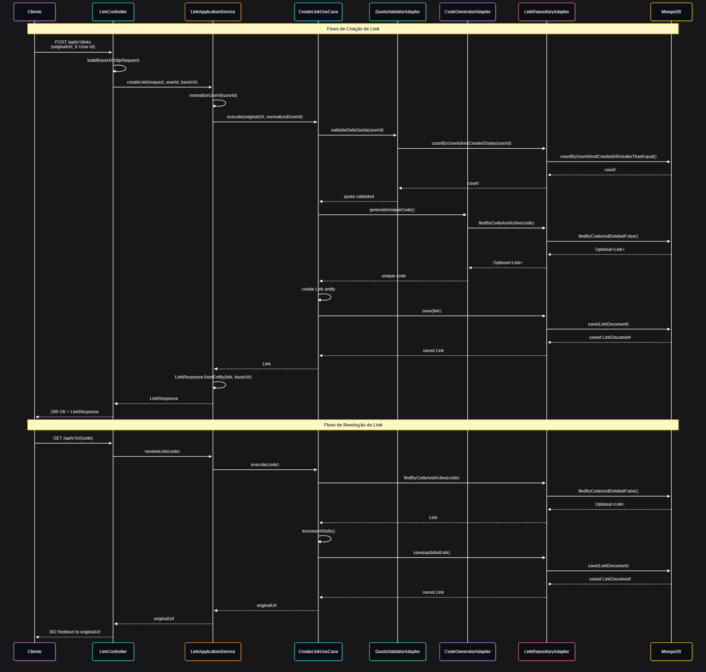

# 🔗 TinyLinks Service

> **Microserviço de Encurtamento de URLs** - Projeto demonstrativo de habilidades em Clean Architecture e Desenvolvimento de Software

[](https://openjdk.java.net/)
[](https://spring.io/projects/spring-boot)
[](https://www.mongodb.com/)
[](https://blog.cleancoder.com/uncle-bob/2012/08/13/the-clean-architecture.html)

## Sobre o Projeto

Este é um **Projeto Demonstrativo** que visa apresentar minhas habilidades e conhecimentos atuais em desenvolvimento de software, com foco especial na implementação dos princípios da **Clean Architecture**.

O **TinyLinks** é um microserviço completo de encurtamento de URLs que demonstra:

- ✅ **Clean Architecture** - Separação clara de responsabilidades
- ✅ **SOLID Principles** - Código maintível e extensível  
- ✅ **Domain-Driven Design** - Modelagem centrada no negócio
- ✅ **Test-Driven Development** - Desenvolvimento orientado a testes
- ✅ **Microservices Architecture** - Arquitetura de microsserviços

## Arquitetura

### Camadas da Arquitetura

#### **Entities (Camada Central)**
- **`Link.java`** - Entidade de domínio com regras de negócio empresariais
- Contém métodos como `belongsToUser()`, `isActive()`, `incrementVisits()`

#### **Use Cases (Casos de Uso)**
- **`CreateLinkUseCase`** - Criação de links encurtados
- **`ResolveLinkUseCase`** - Resolução e redirecionamento
- **`ListUserLinksUseCase`** - Listagem de links do usuário
- **`DeleteLinkUseCase`** - Exclusão lógica de links

#### **Ports (Interfaces)**
- **`LinkRepositoryPort`** - Contrato para persistência
- **`CodeGeneratorPort`** - Contrato para geração de códigos
- **`QuotaValidatorPort`** - Contrato para validação de quota

#### **Adapters (Implementações)**
- **`LinkRepositoryAdapter`** - Adapta MongoDB para o domínio
- **`CodeGeneratorAdapter`** - Implementa geração de códigos únicos
- **`QuotaValidatorAdapter`** - Implementa validação de quota diária

## Funcionalidades


### **Recursos Principais**

- **Encurtamento de URLs** - Converte URLs longas em códigos curtos
- **Contagem de Visitas** - Rastreia acessos aos links
- **Gestão por Usuário** - Links organizados por usuário
- **Exclusão Lógica** - Soft delete para preservar histórico
- **Quota Diária** - Limite de criação por usuário/dia
- **Rate Limiting** - Proteção contra abuso

### **Endpoints da API**

| Método | Endpoint | Descrição              |
|--------|----------|------------------------|
| `POST` | `/tinyapp/api/v1/links` | Criar link encurtado   |
| `GET` | `/tinyapp/api/v1/links` | Listar links do usuário |
| `GET` | `/tinyapp/r/{code}` | Resolver e redirecionar |
| `DELETE` | `/tinyapp/api/v1/links/{code}` | Excluir lógica do link |

## Tecnologias Utilizadas

### **Backend**
- **Java 21** - Linguagem de programação
- **Spring Boot 3.5.6** - Framework principal
- **Spring Data MongoDB** - Persistência de dados
- **Spring Validation** - Validação de dados
- **Resilience4j** - Rate limiting e circuit breaker

### **Banco de Dados**
- **MongoDB** - Banco de dados NoSQL
- **Spring Data JPA** - Abstração de persistência

### **Documentação**
- **Swagger/OpenAPI 3** - Documentação da API
- **SpringDoc** - Integração com Spring Boot

### **Observabilidade**
- **Spring Boot Actuator** - Métricas e health checks
- **Micrometer** - Métricas de aplicação

## Como Executar

### **Pré-requisitos**
- Java 21+
- Maven 3.8+
- MongoDB (local ou Atlas)

### **Configuração**

1. **Clone o repositório**
```bash
git clone <repository-url>
cd urlshortener
```

2. **Configure o MongoDB**
```yaml
# application.yml
spring:
  data:
    mongodb:
      uri: mongodb://localhost:27017/tinylinks
```

3. **Execute a aplicação**
```bash
mvn spring-boot:run
```

4. **Acesse a documentação**
```
http://localhost:8077/tinyapp/swagger-ui.html
```

## Observação
> *Foi adicionado os contexto na url do serviço apenas por boa prática, porém o correto de caso de uso seria não ter para ficar um link mínimo de redirect.*

## Testes

O projeto implementa testes unitários e de integração seguindo as melhores práticas:

```bash
# Executar todos os testes
mvn test

# Executar testes com cobertura
mvn test jacoco:report
```

## Métricas e Monitoramento

- **Health Check**: `/tinyapp/actuator/health`
- **Métricas**: `/tinyapp/actuator/metrics`
- **Info**: `/tinyapp/actuator/info`

## Referências

- [Clean Architecture - Uncle Bob](https://blog.cleancoder.com/uncle-bob/2012/08/13/the-clean-architecture.html)
- [Spring Boot Documentation](https://docs.spring.io/spring-boot/docs/3.0.0-M1/maven-plugin/reference/htmlsingle/)
- [MongoDB Documentation](https://www.mongodb.com/resources/products/compatibilities/spring-boot/)
- [Resilience4j Documentation](https://www.baeldung.com/spring-boot-resilience4j/)